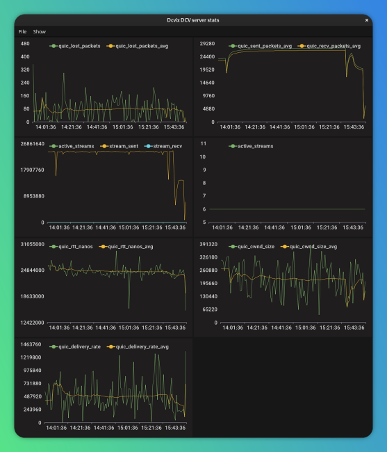

dcvix Stats
===========

Dcvix Stats is a Go application that provides a graphical user interface (GUI) to display statistics from a NICE DCV server log file. It uses the Fyne toolkit for the GUI and the go-charts library to render line charts of various metrics.

The application works by parsing a DCV server log file, extracting statistical data using regular expressions, and then displaying this data in a series of line charts. The user can show or hide them from the "Show" menu.



### Command-line Flags

The Dcvix Stats accepts the following command-line flags:

*   `--version`: Show version information.
*   `--verbose`: Enable verbose logging.
*   `--entries`: How many entries/minutes to evaluate (default 120).
*   `--logfile`: Path to the DCV server log file.
*   `--refresh`: Auto-refresh interval in seconds (default 30).


## Download

Download binaries for Linux or windows from [GitHub releases](https://github.com/dcvix/dcvix-stats/releases)

## Installation
No installation need.
On linux make the binary executable (`chmod +x dcvix-stats`) and launch it.
On windows just launch the `dcvix-stats.exe`

## Building

Preferred building environment Linux

### Requirements

*   Go 1.23 or later, see GO [Download and install](https://go.dev/doc/install)
*   Fyne library dependencies installed, see Fyne [Getting Started](https://docs.fyne.io/started/)

### To be able to cross compile

* Ensure that Docker is installed and functioning properly.
* `go install github.com/fyne-io/fyne-cross@latest`

### Build the application

The project uses a `Makefile` to simplify common tasks,
the build process will create an executables in the `dist` directory.

### Build Linux and Windows binaries
```bash
make build
```

### Build only Linux or Windows binaries
```bash
make build-linux
make build-windows-cross
```

### Run without building an executable (for testing changes)
```bash
make run
```

### Run without building an executable, with Fyne containers and layouts highlighted (for testing GUI layout)
```bash
make run-debug
```

### Version bump
Automatically raise the minor version number
```bash
make version-bump
```
To manually raise the version just edit the `VERSION` file

### Create a version tag using info from the `VERSION` file (will update FyneApp.toml)
```bash
make tag
```
The tag will be ready to be pushed to GitHub, triggering automatic compilation and release creation.